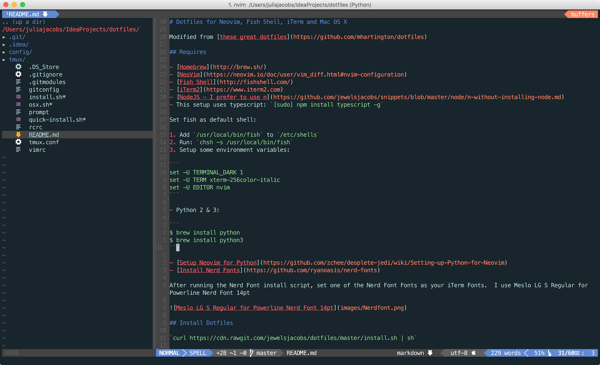
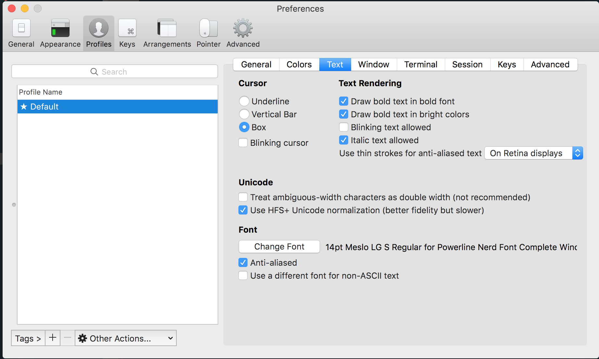

# Dotfiles for Neovim, Fish Shell, iTerm and Mac OS X



Modified from [these great dotfiles](https://github.com/mhartington/dotfiles)

## Requires

- [Homebrew](http://brew.sh/)
- [NeoVim](https://neovim.io/doc/user/vim_diff.html#nvim-configuration)
- [Fish Shell](http://fishshell.com/)
- [iTerm2](https://www.iterm2.com)
- [NodeJS - I prefer to use n](https://github.com/jewelsjacobs/snippets/blob/master/node/n-without-installing-node.md)
- This setup uses typescript: `[sudo] npm install typescript -g`

Set fish as default shell:

1. Add `/usr/local/bin/fish` to `/etc/shells`
2. Run: `chsh -s /usr/local/bin/fish`
3. Setup some environment variables:

```
set -U TERMINAL_DARK 1
set -U TERM xterm-256color-italic
set -U EDITOR nvim
```

- Python 2 & 3

```
$ brew install python
$ brew install python3
```

- [Setup Neovim for Python](https://github.com/zchee/deoplete-jedi/wiki/Setting-up-Python-for-Neovim)
- [Install Nerd Fonts](https://github.com/ryanoasis/nerd-fonts)

After running the Nerd Font install script, set one of the Nerd Font Fonts as your iTerm Fonts.  I use Meslo LG S Regular for Powerline Nerd Font 14pt



## Install Dotfiles

`curl https://cdn.rawgit.com/jewelsjacobs/dotfiles/master/install.sh | sh`

After install script runs do the following to copy the oceanic-next airline theme to the airline theme directory:

`cp ~/.vim/repos/github.com/mhartington/oceanic-next/autoload/airline/themes/oceaicnext.vim ~/.vim/repos/github.com/vim-airline/vim-airline-themes/autoload/airline/themes`

Fire up neovim:

`nvim`

Fix python errors:

```
cd /tmp; git clone https://github.com/vim/vim.git; cd vim
./configure --enable-pythoninterp --prefix=/usr
make; sudo make install
```

When it starts a whole bunch of plugins will load and all should go well.  If not, you'll have to do some debugging.
Make sure to `:set spell` to get rid of the

```
Warning: Cannot find word list "en.utf-8.spl" or "en.ascii.spl"
Warning: Cannot find word list "en.utf-8.spl" or "en.ascii.spl"
```

and download the spell files.
